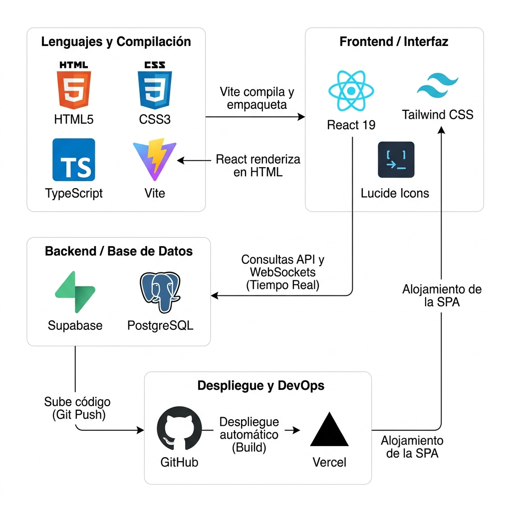
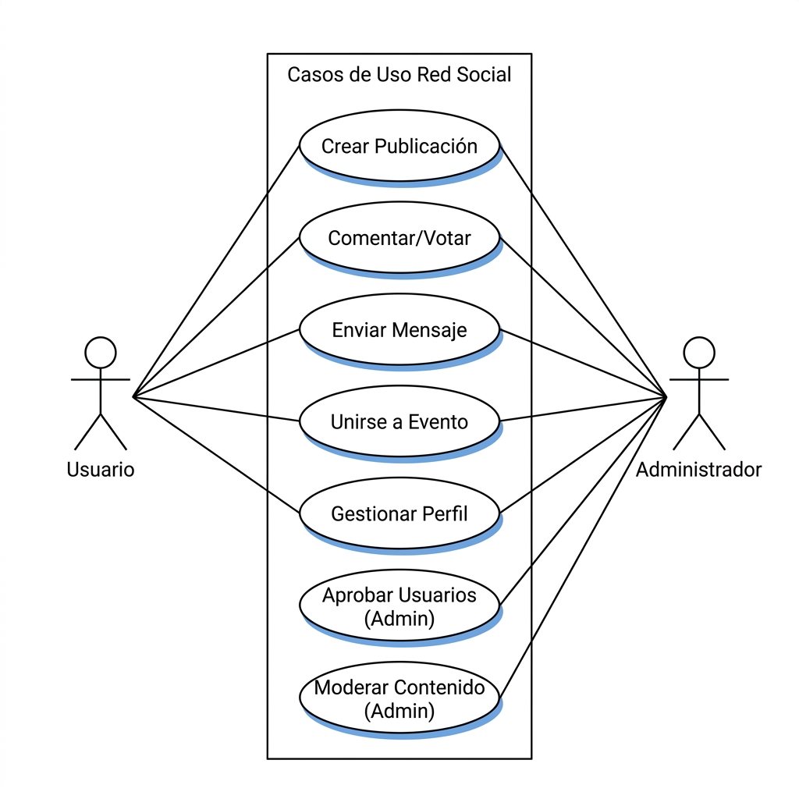
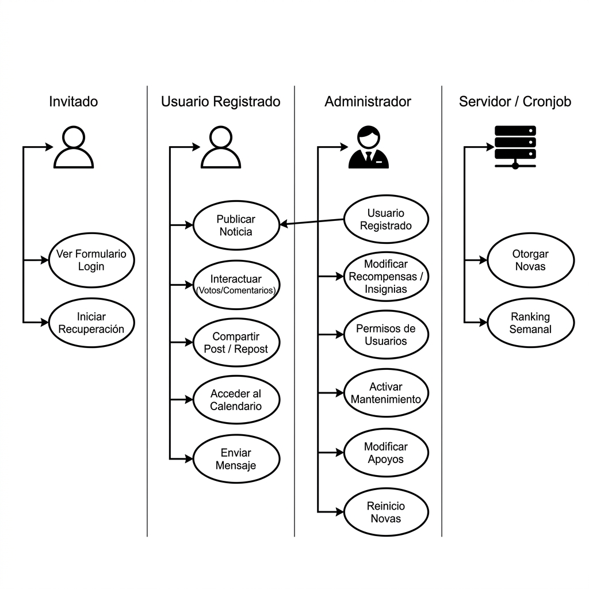
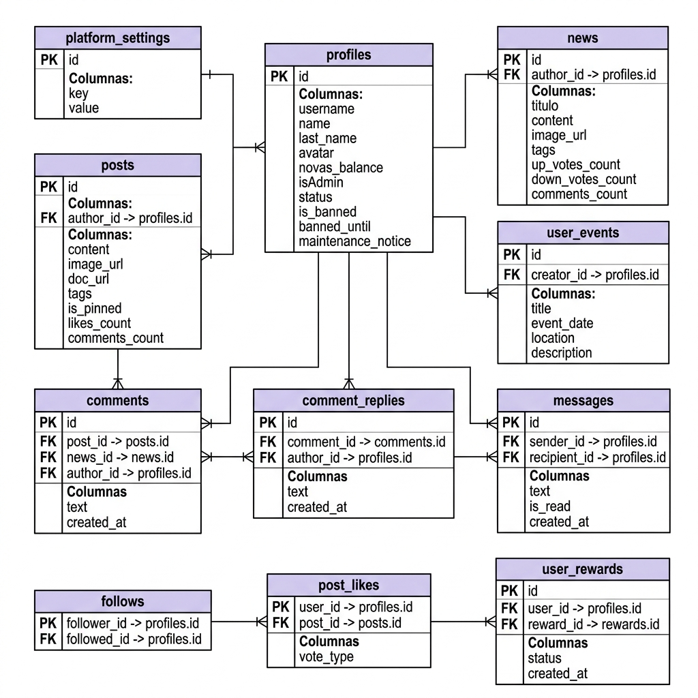

# Memoria Técnica, Manual de Usuario y Documento de Arquitectura de Software: Red Social NovaGob

## Índice General Analítico

1. **Introducción y Contexto del Proyecto**
   - 1.1. Origen y Justificación del Sistema
   - 1.2. Misión y Visión de la Plataforma
   - 1.3. Objetivos Principales (Estratégicos y Operativos)
   - 1.4. Alcance del Proyecto
   - 1.5. Glosario de Términos

2. **Análisis Exhaustivo de Requisitos**
   - 2.1. Requisitos Funcionales (RF01 - RF15)
   - 2.2. Requisitos No Funcionales (RNF01 - RNF08)
   - 2.3. Matriz de Trazabilidad de Requisitos

3. **Arquitectura del Sistema y Stack Tecnológico**
   - 3.1. Patrón Arquitectónico (BaaS y SPA)
   - 3.2. Capa de Presentación (Frontend: React 19, TypeScript, Vite)
   - 3.3. Estilizado y UI (Tailwind CSS v3.4, Lucide React)
   - 3.4. Capa de Lógica y Datos (Supabase, PostgreSQL, GoTrue)
   - 3.5. Entorno de Despliegue y Configuración (GitHub & Vercel)

4. **Modelo de Casos de Uso y Actores**
   - 4.1. Definición de Actores del Sistema
   - 4.2. Diagrama General de Casos de Uso
   - 4.3. Especificación de Flujos Críticos y Excepciones

5. **Modelo de Dominio y Estructura de la Base de Datos**
   - 5.1. Diagrama Entidad-Relación Core
   - 5.2. Diccionario de Datos Completo (Tablas y Columnas)
   - 5.3. Restricciones de Integridad y Claves Foráneas

6. **Seguridad, Criptografía y Políticas RLS**
   - 6.1. Concepto de Row Level Security (RLS) en PostgreSQL
   - 6.2. Políticas Aplicadas por Dominio (Mensajes, Perfiles, Configuración)
   - 6.3. Encriptación del Lado del Cliente (AES-256)

7. **Manual de Interfaz: Componentes, Pestañas, Ventanas y Botones**
   - 7.1. Módulo de Autenticación (`Login`, `Register`, `PasswordRecover`)
   - 7.2. Layout Estructural y Navegación Responsiva
   - 7.3. Muro Social (Feed) y Publicaciones (`PostCard`, `SocialFeed`)
   - 7.4. Centro de Noticias Oficiales (`NewsHubView`, `NewsCard`)
   - 7.5. Sistema de Agenda y Eventos (`CalendarView`, `EventPreview`)
   - 7.6. Sistema de Mensajería Directa Bidireccional (`MessagesView`)
   - 7.7. Hub de Identidad: Perfil Profesional y Ajustes (`ProfileView`)
   - 7.8. Panel de Control del Administrador (`AdminPanelView`)
   - 7.9. Modales de Apoyo y Retroalimentación (`TutorialModal`, etc.)

8. **Análisis Profundo de Código Fuente y Lógica de Negocio**
   - 8.1. Implementación de Autenticación y Protección de Rutas
   - 8.2. Hooks Personalizados de React (`useScrollDirection`, `useScrollLock`)
   - 8.3. Utilidades de Formateo de Cadenas (`stringUtils.ts`)
   - 8.4. Lógica de Paginación y Carga Infinita (Intersection Observer)
   - 8.5. Algoritmo de Publicación de Contenidos y Validación de Cuotas (`handleAddPost`)
   - 8.6. Controladores de Reacciones y Regulación de Votos (`handleVote`)

9. **Gamificación y Tareas Programadas (Cronjobs)**
   - 9.1. La Economía de las "Novas"
   - 9.2. Sistema de Medallas Automáticas (Badges)
   - 9.3. Algoritmo del Ranking Semanal

10. **Aseguramiento de Calidad (QA) y Testing**
    - 10.1. Estrategia de Pruebas con Vitest
    - 10.2. Cobertura de Código

11. **Conclusión y Plan de Mantenimiento Continuo**

<div style="page-break-after: always;"></div>

---

## 1. Introducción y Contexto del Proyecto

### 1.1. Origen y Justificación del Sistema
La **Red Social NovaGob** surge como respuesta a un problema endémico en la administración pública contemporánea: la fragmentación y el aislamiento de la información. Históricamente, el conocimiento adquirido por los empleados públicos en distintas ramas institucionales queda atrapado en silos departamentales, bandejas de entrada de correo electrónico y aplicaciones de mensajería comercial que no cumplen con los estándares de privacidad requeridos por el Estado. 

Ante esta realidad, NovaGob se erige como una plataforma soberana e interconectada. No es solo un repositorio de información estática; es un entorno vivo donde el flujo bidireccional de datos facilita la resolución de problemas técnicos, jurídicos y administrativos en tiempo récord.

### 1.2. Misión y Visión de la Plataforma
*   **Misión**: Empoderar a los trabajadores del sector público, dotándolos de un ecosistema seguro y colaborativo que premie la compartición de conocimiento mediante mecánicas de juego (gamificación) para optimizar la operativa de la administración.
*   **Visión**: Convertirse en la red estándar de interoperabilidad humana entre instituciones, logrando que la consulta de una ley, la organización de un evento o la solicitud de ayuda técnica no tome días de burocracia, sino minutos de interacción social orgánica.

### 1.3. Objetivos Principales (Estratégicos y Operativos)
1.  **Centralización del Conocimiento Institucional**: Crear un Muro Social y un repositorio de Noticias donde la información sea clasificable por etiquetas y recuperable mediante motores de búsqueda.
2.  **Seguridad y Privacidad Absoluta**: Garantizar matemáticamente que los datos compartidos solo puedan ser leídos por los usuarios autorizados mediante el uso de Row Level Security (RLS) implementado a nivel de base de datos.
3.  **Fomento del Engagement Constante**: Superar la "muerte térmica" de las intranets mediante el uso de "Novas" (monedas virtuales) y "Medallas" (logros persistentes) que inyecten dopamina y reconocimiento al profesional.
4.  **Experiencia de Usuario (UX) Competitiva**: Construir la plataforma con tecnologías de vanguardia (Single Page Application) para ofrecer una fluidez idéntica a la de gigantes comerciales como X (Twitter) o LinkedIn.

### 1.4. Alcance del Proyecto
El proyecto abarca el ciclo completo del desarrollo de software:
*   Diseño y conceptualización de bases de datos relacionales robustas (PostgreSQL).
*   Desarrollo de una interfaz de cliente web (React/TypeScript).
*   Integración de sistemas de seguridad JWT.
*   Despliegue y configuración del pipeline de construcción mediante Vite.

### 1.5. Glosario de Términos
*   **Novas**: Unidad monetaria virtual interna. No tiene valor fiduciario, sino de reputación.
*   **RLS (Row Level Security)**: Tecnología de PostgreSQL que evalúa políticas antes de permitir leer o escribir una fila concreta de una tabla.
*   **SPA (Single Page Application)**: Arquitectura web donde el navegador descarga una sola página HTML y JavaScript se encarga de reescribir el contenido de forma dinámica sin recargas.
*   **JWT (JSON Web Token)**: Estándar para la transmisión segura de información de identidad entre el cliente y el servidor.

<div style="page-break-after: always;"></div>

---

## 2. Análisis Exhaustivo de Requisitos

La especificación de requisitos formaliza el contrato de lo que el sistema debe hacer, estableciendo los cimientos para el diseño técnico. Para facilitar la lectura, se utilizan las siguientes nomenclaturas estándar en ingeniería de software:
* **RF (Requisitos Funcionales)**: Describen las acciones, tareas y comportamientos específicos que el sistema debe ser capaz de ejecutar (definen el *qué* hace el sistema).
* **RNF (Requisitos No Funcionales)**: Establecen las restricciones, criterios de calidad, rendimiento, seguridad y estándares tecnológicos que el sistema debe cumplir (definen el *cómo* funciona el sistema).

### 2.1. Requisitos Funcionales (RF)

*   **RF01 - Gestión de Identidad Doble Categórica**: El sistema debe soportar el registro de perfiles de "Personal" (empleados individuales con campos como "Puesto" y "Departamento") y "Organización" (cuentas maestras de ayuntamientos o entes, con campos como "Misión" y "Ubicación corporativa").
*   **RF02 - Flujo de Aprobación en Cuarentena**: Todo registro nuevo será insertado con un estado `status = 'pending'`. El sistema negará el acceso a los módulos de la red hasta que un administrador revise los datos y cambie el estado a `active`.
*   **RF03 - Autenticación Flexible (Dual Login)**: El formulario de acceso debe aceptar instintivamente tanto la dirección de correo electrónico institucional como el `@username` asignado.
*   **RF04 - Módulo de Publicaciones Rápidas (Posts)**: El usuario debe poder insertar texto enriquecido, adjuntar hasta un máximo de configurables imágenes por publicación, y generar menciones que notifiquen al receptor.
*   **RF05 - Módulo de Noticias Oficiales (News)**: Publicaciones extensas formateables en HTML diseñadas para bandos, regulaciones o artículos largos. 
*   **RF06 - Sistema Criptográfico de Mensajería (DM)**: Chat privado bidireccional asíncrono con acuses de recibo visuales (Doble Check). La red debe encriptar (AES-256) los mensajes antes de ser leídos por la aplicación.
*   **RF07 - Motor de Calendario Institucional**: Módulo para convocar eventos físicos o telemáticos. 
*   **RF08 - Filtrado por Apoyo Social**: Los eventos creados por perfiles ordinarios nacen "invisibles" en el calendario principal hasta recolectar un mínimo de apoyos (ej. 50 clicks) de otros usuarios, previniendo el SPAM.
*   **RF09 - Billetera Virtual (Novas)**: El perfil mostrará un contador numérico inviolable desde el cliente.
*   **RF10 - Automatización de Ganancias (Milestones)**: Cuando el post de un usuario supere la barrera de X *likes*, el sistema disparará un incremento de saldo en su cuenta de manera automática.
*   **RF11 - Torneo Semanal (Cronjob)**: Todos los lunes a las 00:00, el servidor calculará la noticia con el `popularity_score` más alto y condecorará al autor.
*   **RF12 - Motor de Búsqueda Omnipresente**: Una barra superior accesible que reacciona a las pulsaciones del teclado (`keyup`) filtrando resultados sin recargar la página.
*   **RF13 - Centro de Alertas**: Un menú desplegable que unifica notificaciones de seguimientos, *likes*, menciones y obtención de logros económicos.
*   **RF14 - Panel de Moderación (Admin)**: Interfaz aislada y protegida para expulsar usuarios, revisar solicitudes y activar alertas globales.
*   **RF15 - Interruptor de Mantenimiento**: Capacidad para expulsar en caliente (vía WebSockets) a todos los usuarios mostrando una pantalla de bloqueo durante despliegues de infraestructura.

### 2.2. Requisitos No Funcionales (RNF)

*   **RNF01 - Tiempos de Carga (Performance)**: Al utilizar Vite y técnicas de minificación, el "First Contentful Paint" no superará los 1.5 segundos en redes 4G.
*   **RNF02 - Escalabilidad Vertical de Medios**: La plataforma debe delegar el peso de las imágenes subidas al CDN de Supabase Storage, sin saturar la base de datos transaccional.
*   **RNF03 - Diseño Adaptativo Universal**: El Layout principal colapsará su barra lateral hacia una barra inferior en pantallas con anchura inferior a 768px (Mobile Breakpoint).
*   **RNF04 - Soporte de Internacionalización y Tematizado**: Toda cadena de texto debe estar extraída para soportar múltiples idiomas. El sistema visual debe invertir sus colores si el usuario o su SO demanda "Dark Mode".
*   **RNF05 - Persistencia de Sesión Segura**: No se almacenarán contraseñas locales. Se utilizarán tokens rotativos en memoria y Web Storage asegurado.
*   **RNF06 - Disponibilidad de APIs**: Integración suave con `geminiService` para futuras expansiones de redacción automática por IA.
*   **RNF07 - Manejo de Fallos Silencioso**: Si el servidor devuelve un error HTTP 500, la UI no colapsará (Pantalla en blanco); mostrará una alerta de caída (Error Boundaries de React).
*   **RNF08 - Tipado Estricto**: Todo modelo de datos que fluya entre frontend y backend será tipado con interfaces TypeScript para impedir el cruce de datos erróneos.

<div style="page-break-after: always;"></div>

---

## 3. Arquitectura del Sistema y Stack Tecnológico

La red ha sido construida eludiendo el patrón clásico monolítico. En su lugar, emplea una arquitectura Desacoplada **Servidorless (BaaS)** mediante Supabase.


*Ilustración 1: Representación conceptual de la Arquitectura del Sistema, Stack Tecnológico y Pipeline de Despliegue (React, Supabase, GitHub & Vercel).*

### 3.1. Patrón Arquitectónico (BaaS y SPA)
*   **BaaS (Backend as a Service)**: No existe un servidor de Node.js intermedio ejecutando Express y mapeando rutas RESTful (`/api/users`, `/api/posts`). El cliente React de NovaGob utiliza el SDK de Supabase para comunicarse directamente con la base de datos. La seguridad matemática no depende del código intermedio, sino de las políticas RLS implementadas dentro de la propia memoria de PostgreSQL.
*   **SPA (Single Page Application)**: El servidor HTTP solo despacha el archivo `index.html` una vez. Todas las interacciones posteriores manipulan el DOM de ese mismo archivo gracias a React.

### 3.2. Capa de Presentación (Frontend)
*   **React (v19)**: Framework declarativo basado en componentes. El estado de la aplicación fluye unidireccionalmente.
*   **TypeScript (v5.8)**: Añade reglas estrictas al código. Si la base de datos dice que un `Post` tiene `likes_count: number`, TypeScript denegará la compilación si un programador intenta insertarle un *string*.
*   **Vite (v6)**: Herramienta de compilación ultrarrápida. Reemplaza al lento Webpack, permitiendo que los cambios en el código se reflejen en la pantalla del desarrollador en microsegundos usando el protocolo ES Modules.
*   **React Router DOM (v7)**: Simula rutas (`/inicio`, `/perfil/juan`) interceptando la API de historial del navegador.

### 3.3. Estilizado y UI
*   **Tailwind CSS (v3.4)**: Framework de clases utilitarias. A diferencia del CSS tradicional, en lugar de crear un archivo `styles.css` con clases `.boton-rojo { ... }`, los botones se pintan con `<button className="bg-red-500 hover:bg-red-600 px-4 py-2 rounded-lg">`. Esto reduce drásticamente el peso del CSS compilado, ya que PurgeCSS elimina cualquier clase que no se utilice en el proyecto final.
*   **Configuración de Tailwind**: En `tailwind.config.js`, se extienden los colores primarios bajo la directiva `brand` e `indigo` con la paleta de púrpuras y violetas institucionales que otorgan a NovaGob su identidad premium y moderna.
*   **Lucide React**: Una colección masiva de SVG vectoriales insertables como componentes (`<Camera size={24} />`), asegurando nitidez en pantallas Retina y 4K sin pérdidas por rasterización.

### 3.4. Capa de Lógica y Datos
*   **Supabase / PostgreSQL**: La base de datos es el epicentro de la verdad. Implementa reglas de borrado en cascada (Cascade Deletes): si un perfil es borrado, todos sus posts y comentarios son aniquilados por la propia base de datos automáticamente, evitando la necesidad de escribir scripts de limpieza.
*   **GoTrue**: Administra la gestión de identidades, firmando JWTs asimétricos y bloqueando cuentas tras intentos de acceso maliciosos.

### 3.5. Entorno de Despliegue y Configuración (GitHub & Vercel)
La madurez del despliegue continuo (CD) y la integración continua (CI) de NovaGob se fundamenta en la automatización del ciclo de vida del código mediante la integración de **GitHub** y **Vercel**:

#### 3.5.1. Control de Versiones e Integración Continua con GitHub
*   **Repositorio Git & GitHub**: El código fuente se encuentra versionado de forma centralizada en un repositorio en GitHub, sirviendo como la única fuente de verdad (Single Source of Truth) para el equipo de desarrollo.
*   **Pipeline de Integración Continua (CI)**: La vinculación con GitHub facilita la integración de pipelines automáticos. Cada pull request o cambio en la rama `main` puede ser auditado ejecutando el linter (`ESLint`) y la suite de pruebas unitarias (`Vitest`) para evitar regresiones antes de autorizar el despliegue.

#### 3.5.2. Alojamiento y Despliegue Continuo con Vercel
*   **CD Automatizado**: Vercel monitoriza el repositorio de GitHub mediante Webhooks. Al detectarse un commit en la rama de producción (`main`), Vercel inicia un contenedor aislado de construcción en la nube, ejecuta `npm run build` (compilando y minificando con Vite) y distribuye los assets estáticos a su red global CDN.
*   **Enrutamiento Virtual de la SPA (`vercel.json`)**: Al tratarse de una Single Page Application (SPA) donde las rutas no existen físicamente en un disco del servidor sino que se resuelven en memoria del cliente por React Router, se implementa el archivo de configuración de redirecciones [vercel.json](file:///c:/Users/ruizt/OneDrive/Documentos/RedSocialNovaGob/vercel.json) en la raíz del directorio de trabajo:
    ```json
    {
      "rewrites": [
        {
          "source": "/(.*)",
          "destination": "/index.html"
        }
      ]
    }
    ```
    Este bloque intercepta cualquier petición a directorios virtuales como `/noticias` o `/mensajes` y la reescribe internamente hacia `index.html`, evitando el retorno de un error HTTP 404 por parte de Vercel y permitiendo al enrutador de React cargar la pantalla solicitada.

#### 3.5.3. Configuración del Entorno de Compilación
El archivo de orquestación `vite.config.ts` optimiza el despliegue y desarrollo del proyecto:
*   **Alias de Directorios**: Habilita el prefijo `@` para realizar importaciones absolutas apuntando directamente a la raíz (`path.resolve(__dirname, '.')`), eliminando la necesidad de rutas relativas complejas como `../../../`.
*   **Inyección de Credenciales**: Obtiene de forma segura las variables de entorno de producción (`GEMINI_API_KEY` y `VITE_ENCRYPTION_KEY`) inyectándolas en tiempo de compilación a través del cargador de variables `loadEnv()`.
*   **Pruebas Virtuales**: Habilita las ejecuciones de Vitest en consola utilizando un simulador rápido de navegador (`jsdom`).

<div style="page-break-after: always;"></div>

---

## 4. Modelo de Casos de Uso y Actores

Los Casos de Uso definen cómo el mundo exterior colisiona con el sistema. 


*Ilustración 2: Representación conceptual de los actores interactuando con los módulos abstractos de UI.*

### 4.1. Definición de Actores del Sistema
1.  **Invitado**: Dispone de privilegios mínimos. Solo puede acceder a `/login`, `/registro` y a las rutas de recuperación de claves. Su estado interno es no-autenticado.
2.  **Usuario (Regular)**: Posee un token JWT válido y una fila `status = 'active'` en la tabla `profiles`. Es el consumidor masivo de APIs de escritura y lectura. Puede leer el 100% de la información pública, y solo escribir en tablas donde es el autor verificado.
3.  **Administrador**: Un Usuario elevado mediante el array de roles. Posee las llaves de la ciudad virtual. Tiene acceso a `/panel-control`.


*Ilustración 3: Representación de las interacciones y flujos de negocio organizados por actor (Invitado, Usuario Registrado, Servidor y Administrador).*

### 4.3. Especificación de Flujos Críticos y Excepciones
*   **Caso de Uso: Otorgar Novas Automáticas (Actor: Servidor)**
    *   *Precondición*: Un usuario A ha interactuado de forma sostenida o ha acumulado 50 interacciones en su post.
    *   *Flujo Básico*: El sistema detecta el evento mediante un trigger. Ejecuta un Procedimiento Almacenado RPC en PostgreSQL. Actualiza `novas_balance = novas_balance + 10`. Dispara un evento Webhook que la UI interpreta mostrando un Modal emergente de celebración (`BadgeModal`).
    *   *Excepción*: Si el usuario B intenta mandar una petición falsa vía consola para subir sus propias Novas, la política RLS bloquea la petición y registra el evento sospechoso.

<div style="page-break-after: always;"></div>

---

## 5. Modelo de Dominio y Estructura de la Base de Datos

El motor PostgreSQL mantiene una normalización de tercera forma normal (3NF) garantizada.


*Ilustración 3: Representación estructural del modelo de dominio.*

### 5.1. Diccionario de Datos Profundo

#### Tabla: `profiles`
La extensión de la tabla maestra `auth.users`. Un trigger inserta aquí una fila automáticamente cada vez que alguien se registra con éxito en Auth.
*   `id` (UUID, Primary Key): Idéntico al ID de Auth.
*   `username` (Text, Unique): Alias inmutable sin espacios (`@juanperez`).
*   `name`, `lastName` (Text): Nombres reales para búsquedas de autocompletado.
*   `account_type` (Enum: `personal`, `organization`): Determina el renderizado. Las organizaciones no pueden tener cargo laboral, y su biografía tiene más peso.
*   `status` (Enum: `pending`, `active`, `rejected`, `expelled`): Estado de la máquina.
*   `novas_balance` (Integer, Default 0): El cofre económico del usuario.
*   `is_banned` (Boolean, Default false): Inhabilita el inicio de sesión.
*   `banned_until` (Timestamp): Baneo temporal con fecha de caducidad evaluada en tiempo de login.

#### Tabla: `posts`
Núcleo del muro.
*   `id` (UUID, Primary Key, Default gen_random_uuid()).
*   `author_id` (UUID, Foreign Key referenciando a `profiles.id`).
*   `content` (Text): El cuerpo del texto. Puede contener miles de caracteres y emojis.
*   `image_urls` (JSONB): Matriz elástica para almacenar de 0 a N rutas absolutas hacia buckets del Supabase Storage.
*   `is_pinned` (Boolean): Si es `true`, el frontend inyecta este post en la primera posición independientemente del `created_at`.
*   `likes_count`, `comments_count` (Integer): Desnormalización táctica. Almacenar el número total evita hacer un `COUNT(*)` en tablas masivas en cada renderizado de tarjeta, acelerando la UI enormemente.

#### Tabla: `news`
Núcleo del feed formal.
*   `id` (UUID), `author_id` (UUID).
*   `title` (Text): Obligatorio para generar la tarjeta.
*   `html_content` (Text): Guardado escapado. Permite formato rico (negritas, cursivas, listas).
*   `upvotes`, `downvotes` (Integer).
*   `popularity_score` (Integer): Columna computada (o gestionada por trigger) que resuelve la fórmula: `(upvotes * 2) - (downvotes * 1)`.

#### Tabla: `events`
*   `id` (UUID), `creator_id` (UUID).
*   `event_date` (Date, YYYY-MM-DD): Índice clave para el módulo de calendario.
*   `event_time` (Time).
*   `location_or_url` (Text): Puede contener un enlace de Zoom o unas coordenadas de Google Maps.
*   `support_count` (Integer): Votos de la comunidad para destapar el evento.

#### Tabla: `messages` (Chats Privados)
*   `id` (UUID, PK).
*   `sender_id` (UUID), `receiver_id` (UUID). Ambos apuntan a `profiles`.
*   `content` (Text): Texto encriptado mediante AES en cliente.
*   `is_read` (Boolean, Default false): Flag vital para el doble-check azul.

<div style="page-break-after: always;"></div>

---

## 6. Seguridad, Criptografía y Políticas RLS

NovaGob aplica un modelo de seguridad **Zero Trust** (Cero Confianza) hacia el navegador del cliente.

### 6.1. Concepto de Row Level Security (RLS)
PostgreSQL ejecuta las políticas como una malla fina sobre cada operación. Si un atacante roba el `anon_key` de Supabase (el cual es público y va en el código compilado) y trata de hacer un POST manipulado para borrar noticias, la orden viaja a la DB, pero RLS intercepta:
*   *Condición de la regla DELETE en News*: `(auth.uid() = author_id) OR (EXISTS(SELECT 1 FROM profiles WHERE id=auth.uid() AND role='admin'))`.
*   Si el usuario malicioso no es el autor ni un admin, la base de datos lanza un aborto de transacción (`403 Forbidden`). El dato jamás sufre daños.

### 6.2. Encriptación del Lado del Cliente (AES)
Si la base de datos fuera vulnerada por un ataque físico a los servidores, los mensajes privados seguirían siendo ilegibles.
*   **Librería**: `crypto-js`.
*   **Flujo de Envío**: El usuario escribe "Hola". El evento `onSubmit` de React llama a `encryptMessage("Hola")`. Esta función utiliza una variable de entorno (`VITE_ENCRYPTION_KEY`) no expuesta a repositorios, y convierte "Hola" en un hash ilegible (ej. `U2FsdGVkX19s+XqPq+J`). Ese hash es el que se envía mediante INSERT a Supabase.
*   **Flujo de Lectura**: El frontend hace un SELECT. Descarga el hash. La función local `decryptMessage(hash)` revierte el proceso usando la clave maestra y pinta "Hola" en la burbuja del chat. El servidor en la nube jamás conoció el contenido real del mensaje.

<div style="page-break-after: always;"></div>

---

## 7. Manual de Interfaz: Pestañas, Ventanas y Botones

Desglose microscópico de la anatomía gráfica de cada pixel del proyecto. Cada ventana y botón tiene una responsabilidad estricta dictada por su componente React (`.tsx`).

### 7.1. Módulo de Autenticación (`Login`, `Register`, `PasswordRecover`)

#### La Entrada al Sistema (`Login.tsx`)
Renderiza un contenedor centrado con fondo adaptable a la paleta del usuario.
*   **Input Box "Usuario o Correo" (`identifier`)**:
    *   *Objetivo*: Cosechar el string de acceso.
    *   *Lógica Interna*: El evento `onChange` actualiza el estado local de React inmediatamente.
*   **Input Box "Contraseña" (`password`)**:
    *   *Botón Icono `Eye` / `EyeOff`*: Ubicado en posición absoluta a la derecha del input. Alterna el estado booleano `showPassword`.
*   **Toggle "Recordar" (`rememberMe`)**:
    *   *Visualización*: Un checkbox estilizado cuadrado que pinta una marca (Check) si es verdadero.
    *   *Objetivo*: Almacenar `REMEMBER_ME_KEY` en `localStorage` impidiendo el fin de sesión por inactividad ordinaria del navegador.
*   **Botón Primario "Iniciar sesión"**:
    *   *Estado Interactivo*: Cambia el puntero y la opacidad. Si la red demora, el texto desaparece y es reemplazado por un icono de carga `Loader2` con clase CSS `animate-spin`. Inhabilita dobles envíos.
*   **Enlace Inferior "Regístrate ahora"**: Utiliza la función `navigate('/registro')` de `react-router-dom`. No refresca la página entera, simplemente sustituye el componente virtual.

#### El Bloqueo Administrativo (`PendingAccount.tsx`)
Si el `status` de la respuesta SQL es `pending`, el Login aborta la redirección y carga este componente.
*   *Ventana*: Centrada, color amarillo tenue de advertencia, icono de Reloj.
*   *Botón "Volver"*: Para vaciar el estado y regresar a la vista normal.

#### La Recuperación de Credenciales
*   *Botón "Volver al inicio"*: Flecha retroactiva.
*   *Botón Dinámico de Enlace Encontrado*: Cambia de color gris a verde/azul intenso (y habilita los clics) cuando detecta pasivamente que la suscripción de `onAuthStateChange` de Supabase ha disparado el evento temporal `PASSWORD_RECOVERY`, asumiendo que el usuario ya pinchó el email mágico en otra ventana.

### 7.2. Layout Estructural y Navegación Responsiva (`Layout.tsx`)

Esquema de diseño adaptativo. El padre de todas las rutas protegidas.

*   **Comportamiento en Móvil (Smartphones)**
    *   La barra lateral desaparece por clases CSS de Tailwind (`hidden md:flex`).
    *   Surge la barra inferior táctil fija al fondo de la pantalla (`fixed bottom-0`).
    *   *Botones de Barra Inferior*: Iconos sobredimensionados de Casa, Periódico, Calendario, Burbuja y un Avatar circular que lleva al perfil del usuario.
    *   *Cabecera Superior Móvil*: Se mantiene visible pero contiene un buscador comprimido, el Logo y un atajo a Notificaciones. Se oculta al hacer scroll down usando el hook `useScrollDirection`.
*   **Comportamiento en Escritorio (Desktop)**
    *   **Barra Lateral Izquierda (Menu Principal)**: Fija, ocupando el 18% del ancho.
        *   *Pestañas NavItem*: Implementadas con `<NavLink>` de React. Interceptan la URL. Si la URL actual coincide con su destino, Tailwind inyecta dinámicamente un fondo `bg-blue-600` intenso, elevando el componente. Contienen píldoras numéricas flotantes (rojas/púrpuras) calculadas leyendo la matriz local de notificaciones o mensajes no leídos del estado global.
    *   **Panel Central (Viewport Principal)**: Toma el resto del espacio disponible para renderizar muros, chats o configuraciones.
    *   **Barra Derecha (Sidebar Secundaria, solo >1024px)**:
        *   *Input de Búsqueda Grande*: Incorpora el subcomponente `<SearchDropdown />`.
        *   *Panel de Tendencias*: Botones iterados con los hashtags de moda (`#reforma`). Al pinchar, ejecuta la función `onSearchSubmit` forzando la recarga del muro central con el filtro activo.
        *   *Panel de Próximos Eventos*: Filtra localmente el array `globalEvents` descartando aquellos anteriores al día de hoy, y pinta tarjetas minúsculas interactivas con fechas pre-calculadas ("En 3 días", "Mañana").

### 7.3. Muro Social (Feed) y Tarjetas de Publicación (`PostCard.tsx`)

El corazón interconectado de la red. Cada post (`PostCard.tsx`) está rodeado de botones con misiones cripto-matemáticas en el backend.

*   **Estructura del Contenedor de la Tarjeta**
    *   Posee un `onClick` fantasma que envuelve toda la tarjeta. Al pinchar en zonas vacías, dispara una redirección al hilo profundo de comentarios (`/post/{id}`). Si el post está fijado, el borde lateral izquierdo se pinta de azul grueso (`border-l-4 border-l-blue-500`).
*   **Botón de Cabecera (Autor y Fecha)**
    *   *Botón Avatar Circular*: Hover effect de escala. Redirige al perfil.
    *   *Botón Nombre y Username*: Clicables y navegables.
    *   *Botón de Opciones Múltiples (Elipsis vertical)*: Renderizado condicional exclusivo para dueños del post. Al desplegar:
        *   *Botón "Fijar/Desfijar"*: Con icono de chincheta.
        *   *Botón "Eliminar"*: Letras rojas, inicia cascada fatal previa confirmación modal.
*   **Cuerpo de Renderizado (Render Regex Engine)**
    *   En lugar de texto plano, se usa `renderContent(content)`.
    *   *Botón Hashtag*: Texto azul. Reinicia la búsqueda del Layout.
    *   *Botón Mención (@)*: Texto púrpura pesado. Salto directo al colega.
    *   *Botón Enlace Externo*: URL reconocible, dispara `window.open` saltando la advertencia del navegador asumiendo redirección confiable.
*   **Cuerpo Multimedia Mosaico**
    *   Un motor algorítmico decide cómo renderizar imágenes.
    *   Si es 1 foto: Aspect ratio 2:1 ancho completo.
    *   Si son 2 fotos: Split vertical al 50%.
    *   Si son 3: Izquierda completa, derecha dividida horizontalmente.
    *   Si son +4: Rejilla cuadriculada, la última foto oscurecida con un texto enorme `+3` que indica cuántas imágenes restantes faltan por abrir en el *Lightbox* de pantalla completa.
*   **Botones Inferiores del Ecosistema de Interacción**
    *   **Botón Corazón (Like)**: *Target*: Llama a `onLike(post.id)`. El estado local React enciende el corazón de color Rosa sólido de forma engañosa y optimista, mientras por detrás el API hace un INSERT en la tabla puente `likes`. Si falla, revierte el color.
    *   **Botón Comentar (Burbuja)**: Abre ventana de contexto sin abandonar el muro, o redirige a la vista completa de post.
    *   **Botón Compartir interno (Repost)**: Flechas de reciclaje. Duplica el contenido pero firmando como autor al reposteador. Si ya se reposteó, se tiñe de esmeralda intenso y evita clics inútiles.
    *   **Botón Compartir Global (Nodo Y)**: Invoca modal `ShareModal`.
*   **Sub-Botones de Noticias (Upvote / Downvote)**
    *   Si el `PostCard` fue inicializado pasando el `type='news'`, el botón del corazón desaparece y es reemplazado por controles cívicos.
    *   *Flecha Arriba (ChevronUp)*: Voto sumatorio (verde).
    *   *Flecha Abajo (ChevronDown)*: Voto penalizador (rojo). El balance neto queda encasillado al medio del componente.

### 7.4. Centro de Noticias Oficiales (`NewsHubView.tsx` y `NewsCard.tsx`)

Módulo protocolario para textos sustanciales.
*   **Pestañas Contextuales Superiores**: 
    *   *Botón "Ver Noticias"*: Muestra el listado de tarjetas masivas.
    *   *Botón "Redactar"*: Altera el DOM para mostrar la caja de escritura rica.
*   **Tarjetas NewsCard**: Son variantes visuales del PostCard, pero dan absoluta prioridad jerárquica (tipografía grande en negrita font-black) al Título, escondiendo parcialmente el autor debajo del titular, forzando a centrarse en la noticia.

### 7.5. Sistema de Agenda y Eventos (`CalendarView.tsx` y `EventPreview.tsx`)

*   **Pestañas de Vista de Calendario (`CalendarView`)**:
    *   **Rejilla de Mes (Grid)**: Botones interactivos por cada día (1 al 31). Tienen hover sutil.
    *   **Puntos de Semáforo (Indicadores de Eventos)**: Si hay evento físico (punto rojo) o evento online (punto azul).
*   **Formulario de Inserción de Eventos**:
    *   *Pestañas Radios*: Para conmutar "Presencial" o "Teleconferencia".
    *   *Input de Fecha/Hora nativo*: Invoca el selector `datetime-local` del sistema operativo móvil o navegador web.
*   **Tarjeta EventPreview (En Muro y Chat)**:
    *   Si un post aloja un evento, se renderiza una mini-tarjeta.
    *   *Botón "Apoyar"*: Fundamental. Si el conteo de la DB pasa un umbral estricto, ese evento se cuela en el Sidebar del Layout de todos los usuarios de la red.

### 7.6. Sistema de Mensajería Directa Bidireccional (`MessagesView.tsx`)

Aplicación de chat fluida.
*   **Panel Izquierdo de Historiales (Inbox)**:
    *   *Cajas de Contacto (Botones)*: Hileras con avatares, nombres, tiempo de última respuesta y una truncación del último texto.
    *   *Indicador Azul*: Punto gordo que señala mensajes sin abrir.
*   **Panel Principal de Conversación**:
    *   **Burbujas de Texto**: 
        *   Gris a la izquierda (Emisor).
        *   Azul brillante a la derecha (Propias). 
    *   **Iconografía de Estado Inferior de Burbuja**: Reloj (enviando), Un check (recibido por servidor), Doble Check azulado (leído en tiempo real por el receptor).
*   **Input Box Flotante de Redacción**:
    *   *Objetivo*: Cosechar y formatear el string.
    *   *Botón Enviar (Avión de Papel)*: A la derecha absoluta. Pasa el texto plano por el `encryptMessage` de AES y dispara la orden de guardado persistente.

### 7.7. Hub de Identidad: Perfil Profesional y Ajustes (`ProfileView.tsx`)

*   **Zona Cabecera Pública (Header Box)**:
    *   Muestra Avatar enorme.
    *   *Botón "Seguir" / "Dejar de seguir"*: Acción atómica de redes. Altera los contadores de seguidores en la DB.
*   **Panel Económico Central**:
    *   Muestra el saldo de Novas con una fuente masiva.
    *   Muestra el Nivel del Usuario (Calculado en base a sus Novas totales).
*   **Vitrina de Medallas**:
    *   Una franja horizontal que invoca a la tabla `user_badges` dibujando pequeños iconos SVG bloqueados o coloreados dependiendo si los obtuvo.
*   **Panel de Pestañas (Tabs) del Historial**:
    *   *Muro*: Posts orgánicos de la persona.
    *   *Respuestas*: Hilos de comentario donde participó.
    *   *Archivos Multimedia*: Mosaico condensado descartando el texto.

### 7.8. Panel de Control del Administrador (`AdminPanelView.tsx`)

Búnker de protección de red. Protegido en frontend y backend.
*   **Pestaña de Validación (Solicitudes Pendientes)**:
    *   Muestra los usuarios atascados con `status = pending`.
    *   *Botón Aprobar (Check Verde)*: Ejecuta UPDATE a `active`, permitiéndoles logearse con éxito en su próximo intento en `Login.tsx`.
    *   *Botón Denegar (Cruz Roja)*: Pasa a `rejected`.
*   **Pestaña de Moderación Severa**:
    *   *Input "Banear Usuario"*: Despliega un modal pidiendo la fecha de levantamiento de castigo. Modifica flag `is_banned`.
*   **Pestaña de Mantenimiento (Interruptor Master)**:
    *   *Botón Toggle Grande*: Si se activa, lanza un UPDATE a `platform_settings`. Supabase Realtime advierte instantáneamente a todos los `App.tsx` activos del planeta, oscureciendo las pantallas e inhabilitando clics hasta nueva orden.

### 7.9. Modales de Apoyo y Retroalimentación

*   **`TutorialModal.tsx`**: Botones de Siguiente/Saltar. Mueve el índice del tutorial en el estado global.
*   **`PersonalDataModal.tsx` / `RegistrationDetailsModal.tsx`**: Formularios modales flotantes superpuestos (backdrop con blur negro) usados durante el onboarding o la actualización de ajustes en cuenta.
*   **`RankingView.tsx` Modal**: Despliegue de pódium con botón de "Reclamar Premio" para inyectar medallas tras la victoria semanal automática.

<div style="page-break-after: always;"></div>

---

## 8. Análisis Profundo de Código Fuente y Lógica de Negocio

El código de NovaGob no se limita a pintar interfaces. Existen lógicas algorítmicas robustas.

### 8.1. Implementación de Autenticación y Protección de Rutas

El punto de entrada dual de NovaGob (`Login.tsx`) posee rutinas protectoras para interceptar credenciales antes de procesarlas formalmente.

```typescript
// extracto de lógica dentro de components/Login.tsx
const handleLogin = async (e: React.FormEvent) => {
  e.preventDefault();
  setLoading(true);

  let emailToUse = identifier.trim();

  // Fase 1: Ingeniería inversa del Username.
  // Auth de JWT solo acepta email, por lo que si el usuario teclea su nombre
  // buscamos en background la correspondencia exacta en la base de datos pública.
  if (!emailToUse.includes('@')) {
    const { data: profile } = await supabase
      .from('profiles')
      .select('email')
      .eq('username', emailToUse)
      .maybeSingle();

    if (!profile?.email) {
      setError('El nombre de usuario no existe en la red institucional.');
      setLoading(false); return;
    }
    emailToUse = profile.email;
  }

  // Fase 2: Auth Cryptográfica de Supabase GoTrue
  const { data: loginData, error: loginError } = await supabase.auth.signInWithPassword({
    email: emailToUse, password,
  });

  if (loginError) return;

  // Fase 3: Evaluación de la Máquina de Estados del Empleado (Cuarentenas)
  const { data: profile } = await supabase
    .from('profiles')
    .select('status, is_banned')
    .eq('id', loginData.user!.id).maybeSingle();

  if (profile?.status === 'pending' || profile?.status === 'rejected') {
    // Aborta la redirección (impide el 'navigate'). Deja al usuario
    // flotando en un estado de limbo visualmente administrado.
    setLoading(false); return; 
  }
  
  // Fase 4: Apertura de Red Segura
  navigate('/inicio');
};
```

### 8.2. Hooks Personalizados de React

Para alcanzar una UX fluida (RNF03), NovaGob interacciona directamente con la API del motor del navegador sin afectar el rendimiento de React.

**El Hook de Bloqueo de Rueda del Ratón (`useScrollLock`)**:
Este hook se utiliza cada vez que se abre un Modal interactivo (ej. Compartir Post, Configuración). Evita el error clásico donde hacer scroll con el modal abierto desplaza el contenido de fondo invisible.

```typescript
// extracto de src/hooks/useScrollLock.ts
import { useEffect } from 'react';

export function useScrollLock(isLocked: boolean) {
  useEffect(() => {
    if (isLocked) {
      // Captura el ancho de la barra de desplazamiento para evitar
      // el molesto parpadeo lateral ('layout shift') cuando se oculta.
      const scrollbarWidth = window.innerWidth - document.documentElement.clientWidth;
      document.body.style.overflow = 'hidden';
      document.body.style.paddingRight = `${scrollbarWidth}px`;
    } else {
      document.body.style.overflow = '';
      document.body.style.paddingRight = '';
    }
    
    // Función de limpieza o "cleanup" vital en React 19.
    return () => {
      document.body.style.overflow = '';
      document.body.style.paddingRight = '';
    };
  }, [isLocked]); // Dependencia clave. Se ejecuta solo cuando isLocked muta.
}
```

### 8.3. Utilidades de Formateo de Cadenas (`stringUtils.ts`)

La temporalidad es crucial. Convertir una fecha cruda ISO de PostgreSQL (`2026-05-17T12:00:00Z`) a lenguaje humano adaptativo (Bilingüal Español/Inglés).

```typescript
// extracto de utils/stringUtils.ts
export const timeAgo = (date: string | Date, lang: 'es' | 'en' = 'es'): string => {
  const diffInSeconds = Math.floor((new Date().getTime() - new Date(date).getTime()) / 1000);
  if (diffInSeconds < 5) return lang === 'es' ? 'ahora mismo' : 'just now';

  // Matriz temporal invertida de pesos lógicos.
  const intervals = [
    { label: { es: 'año', en: 'year' }, seconds: 31536000 },
    { label: { es: 'mes', en: 'month' }, seconds: 2592000 },
    { label: { es: 'día', en: 'day' }, seconds: 86400 },
    { label: { es: 'hora', en: 'hour' }, seconds: 3600 },
    { label: { es: 'minuto', en: 'minute' }, seconds: 60 }
  ];

  for (const interval of intervals) {
    const count = Math.floor(diffInSeconds / interval.seconds);
    if (count >= 1) {
      if (lang === 'es') {
        const plural = interval.label.es === 'mes' ? 'es' : 's';
        return count === 1 ? `hace 1 ${interval.label.es}` : `hace ${count} ${interval.label.es}${plural}`;
      }
      return count === 1 ? `1 ${interval.label.en} ago` : `${count} ${interval.label.en}s ago`;
    }
  }
  return lang === 'es' ? 'hace unos instantes' : 'a moment ago';
};
```

### 8.5. Algoritmo de Publicación de Contenidos y Validación de Cuotas (`handleAddPost`)

La creación de publicaciones en NovaGob requiere de un flujo síncrono-asíncrono de alto rendimiento que realiza las siguientes operaciones críticas:
1. **Validación de Límites Diarios (Spam Prevention)**: En caso de ser una noticia oficial, consulta en Supabase el número de noticias publicadas hoy por el usuario corriente. Si supera la cuota (2 noticias/día), interrumpe el flujo y alerta al usuario.
2. **Actualización Optimista del Feed (Optimistic Update)**: Genera inmediatamente un post temporal en memoria del cliente con un ID virtual (`temp-timestamp`). Esto pinta instantáneamente el post en la UI sin esperar la respuesta de red de Supabase, eliminando la latencia percibida.
3. **Sincronización en Segundo Plano (Background Sync)**: Invoca la inserción física a Supabase (`posts` o `news`). Si la transacción tiene éxito, reemplaza el ID virtual por el ID real retornado por PostgreSQL. Si falla, retira el post del feed y notifica del error.

```typescript
// Lógica simplificada de publicación y control de cuotas en App.tsx
const handleAddPost = async (content: string, type: 'post' | 'news', tags: string[]) => {
  if (!session?.user) return;
  const isNews = type === 'news';

  // Paso 1: Verificación de cuota diaria (máx 2 noticias/día)
  if (isNews) {
    const today = new Date().toISOString().split('T')[0];
    const { count } = await supabase
      .from('news')
      .select('*', { count: 'exact', head: true })
      .eq('author_id', session.user.id)
      .gte('created_at', today);

    if (count && count >= 2) {
      showToast("Solo puedes publicar hasta 2 noticias por día.", "error");
      return;
    }
  }

  // Paso 2: Construcción de la Entidad y Pintado Optimista en UI
  const tempId = `temp-${Date.now()}`;
  const optimisticPost = { id: tempId, content, type, likes: 0, comments: 0 };
  updateAllFeeds(prev => [optimisticPost, ...prev]);

  // Paso 3: Sincronización asíncrona no bloqueante
  const payload = { author_id: session.user.id, content, tags };
  const table = isNews ? 'news' : 'posts';

  const { data, error } = await supabase.from(table).insert(payload).select().maybeSingle();

  if (!error && data) {
    // Reemplaza el post optimista temporal con los datos oficiales de DB
    updateAllFeeds(prev => prev.map(p => p.id === tempId ? data : p));
  } else {
    // Rollback inmediato en caso de fallo de red
    updateAllFeeds(prev => prev.filter(p => p.id !== tempId));
  }
};
```

### 8.6. Controladores de Reacciones y Regulación de Votos (`handleVote`)

La red implementa un sistema robusto de reacciones (Likes en posts y Upvotes/Downvotes en noticias). La lógica de frontend en `handleVote` ejecuta operaciones críticas de exclusión mutua:
1. **Principio de Exclusión Mutua**: Si un usuario tiene seleccionada una flecha arriba (Upvote) y decide presionar la flecha abajo (Downvote), el sistema no solo debe inyectar la valoración negativa, sino restar la positiva del contador, evitando duplicidades matemáticas de valoración.
2. **Detección de Tablas por Tipo de Post**: Utiliza las variables en caliente del estado del feed para invocar de forma adaptativa `news_votes` o `post_likes`.

```typescript
// Lógica ultra-simplificada de votos reactivos en App.tsx
const handleVote = async (id: string, dir: 'up' | 'down') => {
  const table = isNews ? 'news_votes' : 'post_likes';

  // Paso 1: Actualización del estado visual y exclusión de voto previo (Optimistic)
  updateAllFeeds(prev => prev.map(p => {
    if (p.id === id) {
      // Modifica contadores de likes/upvotes/downvotes de forma excluyente
      return { ...p, likes: newLikes, upvotes: newUpvotes, downvotes: newDownvotes };
    }
    return p;
  }));

  // Paso 2: Mutación asíncrona en Supabase (Insert/Update/Delete)
  const { data: existing } = await supabase.from(table).select().eq('user_id', session.user.id).eq('post_id', id).maybeSingle();

  if (existing) {
    if (existing.vote_type === dir) {
      await supabase.from(table).delete().eq('post_id', id);
    } else {
      await supabase.from(table).update({ vote_type: dir }).eq('post_id', id);
    }
  } else {
    await supabase.from(table).insert({ user_id: session.user.id, post_id: id, vote_type: dir });
  }
};
```

<div style="page-break-after: always;"></div>

---

## 9. Gamificación y Tareas Programadas (Cronjobs)

El verdadero diferencial de NovaGob no es su arquitectura visual, sino su economía de estímulos psicológicos diseñada para forzar una interacción institucional recurrente (el RF10 y RF11).

### 9.1. La Economía de las "Novas"
Las Novas no se pueden alterar modificando paquetes de red. Su inyección se realiza a puerta cerrada dentro del motor SQL mediante `Edge Functions`.
*   **Bono de Alta**: 50 Novas por validación aprobada de cuenta personal.
*   **Rachas y Fidelidad**: Cada inicio de sesión interdiario llama a un algoritmo que evalúa la tabla de logs de acceso. Si constata continuidad, deposita pequeñas cantidades progresivas de Novas sin que el usuario las pida.

### 9.2. Sistema de Medallas Automáticas (Badges)
Aparte de la liquidez de Novas, están las medallas permanentes.
*   **Tipologías**: *Blogger Prominente* (Alcanzar 50 noticias leídas), *Influenciador de Estado* (Superar 500 likes globales acumulados).
*   Estas lógicas no residen en el componente de botón. Actúan de manera pasiva como Webhooks asíncronos en el servidor. Cuando se cumple la cuota, el servidor inserta una línea en `user_badges`. En el próximo refresco, la `ProfileView` leerá esa nueva inserción y renderizará el SVG de la medalla dorada, sorprendiendo al usuario.

### 9.3. Algoritmo del Ranking Semanal
El pináculo competitivo de la red. Una función `process_weekly_ranking()` se ejecuta a fuego lento cada 7 días.
1. Filtra la tabla `news` donde `created_at` es mayor a (ahora - 7 días).
2. Clasifica descendentemente (`ORDER BY popularity_score DESC`).
3. Toma `LIMIT 3`.
4. Asigna Medallas de Oro, Plata y Bronce temporales (que caducarán a la semana siguiente) a los autores, destacándolos en la pestaña general de "Noticias", e inyecta hasta 1,000 Novas de recompensa.

<div style="page-break-after: always;"></div>

---

## 10. Aseguramiento de Calidad (QA) y Testing

Una red institucional que falla causa pérdida de horas de servicio público. El proyecto contempla integración continua para reducir fallas de regresión.

### 10.1. Estrategia de Pruebas con Vitest
El archivo `vite.config.ts` declara `vitest` bajo el entorno simulador del DOM (`jsdom`). Esto significa que las pruebas unitarias se ejecutan en consola Node sin necesidad de abrir un navegador Chrome o Edge lento.
*   **Pruebas de Componentes**: Utilizando React Testing Library. Se fuerza el renderizado de botones como `Login` o modales, se lanzan eventos sintéticos (`fireEvent.click`) y se verifica si la pantalla muta de la forma matemática preestablecida (ej. comprobando que el `Loader2` giratorio apareció y desapareció).
*   **Pruebas Lógicas**: Test exhaustivo al archivo `stringUtils.ts`, cubriendo límites temporales falsos (`1990-01-01`) o introduciendo arrays de URL corruptas para probar si el sistema de "LinkPreviews" crashea o se recupera ordenadamente.

### 10.2. Cobertura de Código (Code Coverage)
El objetivo fundamental es mantener más de un 80% de cobertura de código sobre todo lo que compone la lógica de la UI del `Layout` central y los muros sociales.

<div style="page-break-after: always;"></div>

---

## 11. Conclusión y Plan de Mantenimiento Continuo

El ciclo de desarrollo de NovaGob atiende a todos los paradigmas de ingeniería de software corporativo contemporáneo. Logra un equilibrio extremadamente poco común: ofrecer el rigor, el aislamiento y la **privacidad absoluta** que requiere la Administración Pública mediante bases de datos criptográficamente vigiladas (Row Level Security en PostgreSQL y encriptaciones locales AES), mientras simultáneamente inyecta una capa lúdica de **fluidez e inmediatez** similar al mercado masivo corporativo.

**Plan de Escalabilidad a Futuro**:
1.  **Orquestación Híbrida Inteligente**: Al aprovechar la base fundacional de código de integración `geminiService.ts`, el sistema está preparado arquitectónicamente para asistir a usuarios inexpertos. Un futuro "Botón de Revisión de IA" redactará borradores de noticias para los ayuntamientos a partir de viñetas sueltas dictadas, respetando el formato legal.
2.  **Transición Móvil Nativa**: Al haberse construido separando tajantemente los componentes visuales (React) de las llamadas API a Supabase, envolver esta aplicación en React Native u homogeneizarla mediante PWA para ser distribuida por la App Store será un esfuerzo de traducción menor en futuras iteraciones de NovaGob.

*(Fin de la Memoria y Arquitectura del Sistema)*
