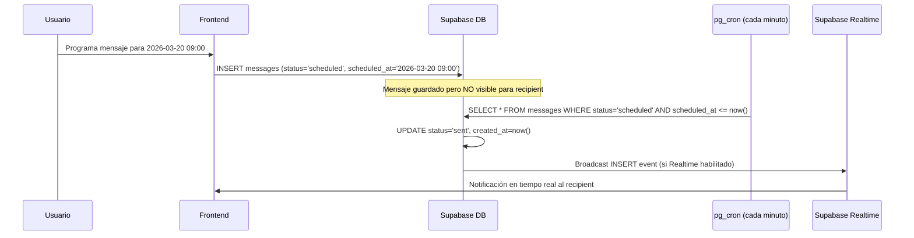

# 📋 Messaging System — Especificación de Tests + Diseño Programación (SDD)

> **Proyecto**: RedSocialNovaGob  
> **Fecha**: 2026-03-19  
> **Autor**: QA Senior Agent + Arquitecto de Sistemas  
> **Método**: Spec-Driven Development (SDD)  
> **Fuente de datos**: Auditoría en vivo via Supabase MCP

---

## PARTE 1: Auditoría del Sistema Actual

### 1.1 Esquema `messages` (13 columnas)

| Columna | Tipo | Nullable | Default | Rol |
|---|---|---|---|---|
| `id` | uuid | NO | `uuid_generate_v4()` | PK |
| `sender_id` | uuid | NO | — | FK → `profiles(id)` CASCADE |
| `recipient_id` | uuid | NO | — | FK → `profiles(id)` CASCADE |
| `text` | text | NO | — | Contenido del mensaje |
| `is_post_share` | boolean | SÍ | `false` | Marca si es un post compartido |
| `post_id` | uuid | SÍ | — | FK → `posts(id)` SET NULL |
| `shared_profile_id` | uuid | SÍ | — | FK → `profiles(id)` (sin CASCADE) |
| `shared_event_id` | uuid | SÍ | — | FK → `user_events(id)` SET NULL |
| `is_read` | boolean | SÍ | `false` | Estado de lectura |
| `created_at` | timestamptz | NO | `timezone('utc', now())` | Timestamp de creación |
| `updated_at` | timestamptz | SÍ | — | Última actualización |
| `deleted_for` | uuid[] | SÍ | `'{}'::uuid[]` | Array de IDs que han eliminado el msg |
| `is_deleted` | boolean | SÍ | `false` | Eliminación global |

### 1.2 Constraints (6)

| Constraint | Tipo | Definición |
|---|---|---|
| `messages_pkey` | PK | `PRIMARY KEY (id)` |
| `messages_sender_id_fkey` | FK | `→ profiles(id) ON DELETE CASCADE` |
| `messages_recipient_id_fkey` | FK | `→ profiles(id) ON DELETE CASCADE` |
| `messages_post_id_fkey` | FK | `→ posts(id) ON DELETE SET NULL` |
| `messages_shared_profile_id_fkey` | FK | `→ profiles(id)` (**sin CASCADE!**) |
| `messages_shared_event_id_fkey` | FK | `→ user_events(id) ON DELETE SET NULL` |

### 1.3 Triggers

> ❌ **No hay triggers** en la tabla `messages`.

### 1.4 Funciones relacionadas

> ❌ **No se encontraron funciones** con nombre que contenga `message`, `chat` o `conversation`.

### 1.5 Políticas RLS (5)

| Política | Operación | Rol | Condición |
|---|---|---|---|
| `messages_insert_policy` | INSERT | `authenticated` | `sender_id = auth.uid()` |
| `messages_select_policy` | SELECT | `authenticated` | `sender_id = auth.uid() OR recipient_id = auth.uid()` |
| `Users can update their own messages` | UPDATE | ⚠️ `public` | `auth.uid() = sender_id` (USING + WITH CHECK) |
| `Users can edit deleted_for` | UPDATE | ⚠️ `public` | `auth.uid() = sender_id OR auth.uid() = recipient_id` |
| `messages_update_policy` | UPDATE | `authenticated` | `recipient_id = auth.uid()` (para marcar `is_read`) |
| *(No existe)* | DELETE | ❌ | **Sin policy DELETE** |

### 1.6 Supabase Realtime

| Aspecto | Estado |
|---|---|
| `pg_publication` — `supabase_realtime` | ❌ **`messages` NO está incluida** |
| Frontend `subscribe()` | ❌ No encontrado en `MessagesView.tsx` |
| Patrón actual | **Polling** (fetch manual por el usuario) |

**Tablas en `supabase_realtime`**: `news`, `news_comments`, `news_votes`, `post_comments`, `post_likes`, `posts`, `profiles`.

### 1.7 Estadísticas de Producción

| Métrica | Valor |
|---|---|
| Total mensajes | 19 |
| Post shares | 0 |
| Profile shares | 0 |
| Event shares | 0 |
| Mensajes leídos | 19 (100%) |
| Soft-deleted (`is_deleted`) | 3 |
| Senders únicos | 2 |
| Recipients únicos | 2 |
| Huérfanos (sender/recipient) | 0 ✅ |
| Rango temporal | 2026-03-05 → 2026-03-17 |

---

## PARTE 2: Especificaciones de Tests

### 2.1 🟢 TC-MSG — Envío de Mensajes (7 tests)

#### TC-MSG-001: Envío básico texto
- **Acción**: INSERT con `sender_id`, `recipient_id`, `text`
- **Resultado esperado**: Defaults: `is_read=false`, `is_post_share=false`, `deleted_for='{}'`, `is_deleted=false`

#### TC-MSG-002: Compartir post vía DM
- **Acción**: INSERT con `is_post_share=true`, `post_id=<uuid>`
- **Resultado esperado**: FK `messages_post_id_fkey` valida el post_id

#### TC-MSG-003: Compartir perfil vía DM
- **Acción**: INSERT con `shared_profile_id=<uuid>`
- **Resultado esperado**: FK valida, pero ⚠️ sin CASCADE

#### TC-MSG-004: Compartir evento vía DM
- **Acción**: INSERT con `shared_event_id=<uuid>`
- **Resultado esperado**: FK `messages_shared_event_id_fkey` SET NULL si se elimina

#### TC-MSG-005: FK — sender_id/recipient_id deben existir
- **Acción**: INSERT con user inexistente
- **Resultado esperado**: Error FK

#### TC-MSG-006: No se puede enviar como otro usuario
- **Verificación**: RLS `sender_id = auth.uid()`
- **Resultado esperado**: Solo puedes enviar mensajes como tú mismo

#### TC-MSG-007: Enviar mensaje a ti mismo
- **Acción**: INSERT con `sender_id = recipient_id`
- **⚠️ Observación**: No hay CHECK que lo impida a nivel DB

---

### 2.2 🔵 TC-READ — Lectura y Estado (5 tests)

#### TC-READ-001: Solo emisor y receptor pueden leer
- **Verificación**: RLS `sender_id = auth.uid() OR recipient_id = auth.uid()`
- **Resultado esperado**: Terceros no ven el mensaje

#### TC-READ-002: Marcar como leído (is_read)
- **Acción**: UPDATE `is_read = true` por el receptor
- **Resultado esperado**: `messages_update_policy` permite al `recipient_id`

#### TC-READ-003: Soft-delete por usuario (deleted_for)
- **Acción**: UPDATE `deleted_for = array_append(deleted_for, auth.uid())`
- **Resultado esperado**: Solo el propietario puede modificar via `Users can edit deleted_for`

#### TC-READ-004: Eliminación global (is_deleted)
- **Acción**: UPDATE `is_deleted = true` por el sender
- **Resultado esperado**: Solo el sender puede via `Users can update their own messages`

#### TC-READ-005: No existe política DELETE
- **Verificación**: `pg_policies WHERE cmd = 'DELETE'`
- **Resultado esperado**: ⚠️ No hay DELETE policy — los registros no se pueden eliminar físicamente

---

### 2.3 🟣 TC-REALTIME — Recepción en Tiempo Real (4 tests)

#### TC-REALTIME-001: `messages` NO está en `supabase_realtime`
- **Verificación MCP**: `pg_publication_tables`
- **Resultado esperado**: 🔴 **BUG — `messages` no publicada para Realtime**

#### TC-REALTIME-002: Frontend no usa `subscribe()`
- **Verificación**: Grep en `MessagesView.tsx`
- **Resultado esperado**: ⚠️ Sin suscripción — usa polling

#### TC-REALTIME-003: Propuesta — Habilitar Realtime
- **Fix necesario**: `ALTER PUBLICATION supabase_realtime ADD TABLE messages;`
- **Impacto**: Permite suscripciones en tiempo real vía `supabase.channel()`

#### TC-REALTIME-004: RLS compatible con Realtime
- **Verificación**: `messages_select_policy` filtra por sender/recipient
- **Resultado esperado**: ✅ Las filas Realtime solo se enviarán a sender/recipient

---

### 2.4 🔴 TC-SECURITY — Seguridad RLS (5 tests)

#### TC-SECURITY-001: INSERT solo como authenticated + tu propio sender_id
- **Resultado esperado**: ✅ Correcto

#### TC-SECURITY-002: SELECT solo sender/recipient
- **Resultado esperado**: ✅ Correcto

#### TC-SECURITY-003: ⚠️ UPDATE policies con rol `public`
- **Hallazgo**: 2 policies UPDATE usan rol `public` en vez de `authenticated`
- **Impacto**: Teóricamente permite a usuarios no autenticados ejecutar UPDATEs
- **Mitigación**: `auth.uid()` en USING clause protege en la práctica

#### TC-SECURITY-004: ⚠️ 3 UPDATE policies superpuestas
- **Hallazgo**: `messages_update_policy`, `Users can update their own messages`, `Users can edit deleted_for` tienen scopes que se solapan
- **Riesgo**: Confusión de permisos — el recipient puede UPDATE cualquier campo

#### TC-SECURITY-005: ❌ Sin DELETE policy
- **Hallazgo**: No existe policy DELETE en `messages`
- **Impacto**: Los mensajes no se pueden eliminar físicamente

---

## PARTE 3: Diseño — Mensajes Programados

### 3.1 Diagrama de Arquitectura



### 3.2 Cambios de Schema Propuestos

#### Opción A: Columnas nuevas en `messages`

```sql
-- Nuevas columnas
ALTER TABLE public.messages
ADD COLUMN status TEXT NOT NULL DEFAULT 'sent' 
    CHECK (status IN ('draft', 'scheduled', 'sent', 'failed')),
ADD COLUMN scheduled_at TIMESTAMPTZ DEFAULT NULL;

-- Índice parcial para el cron job (solo mensajes pendientes)
CREATE INDEX idx_messages_scheduled 
    ON public.messages (scheduled_at) 
    WHERE status = 'scheduled' AND scheduled_at IS NOT NULL;
```

#### Validación de coherencia:
```sql
-- scheduled_at solo puede tener valor si status = 'scheduled'
ALTER TABLE public.messages
ADD CONSTRAINT chk_scheduled_coherence 
    CHECK (
        (status = 'scheduled' AND scheduled_at IS NOT NULL) OR
        (status != 'scheduled')
    );
```

### 3.3 Modificación RLS para Mensajes Programados

```sql
-- El recipient NO debe ver mensajes con status != 'sent'
-- Actualizar la policy de SELECT:
DROP POLICY "messages_select_policy" ON public.messages;
CREATE POLICY "messages_select_policy" ON public.messages
    FOR SELECT TO authenticated
    USING (
        (sender_id = auth.uid()) OR
        (recipient_id = auth.uid() AND status = 'sent')
    );
```

**Lógica**: El sender puede ver TODOS sus mensajes (incluyendo `scheduled`, `draft`), pero el recipient solo ve los que tienen `status = 'sent'`.

### 3.4 Función pg_cron para Procesamiento

```sql
CREATE OR REPLACE FUNCTION public.fn_process_scheduled_messages()
RETURNS void
LANGUAGE plpgsql
SECURITY DEFINER
AS $$
DECLARE
    v_msg RECORD;
BEGIN
    FOR v_msg IN (
        SELECT id, sender_id, recipient_id
        FROM public.messages
        WHERE status = 'scheduled'
        AND scheduled_at <= now()
        ORDER BY scheduled_at ASC
        FOR UPDATE SKIP LOCKED  -- Evita race conditions si cron ejecuta dos veces
    )
    LOOP
        UPDATE public.messages
        SET status = 'sent',
            updated_at = now()
        WHERE id = v_msg.id;
        
        -- Crear notificación para el recipient
        INSERT INTO public.notifications (user_id, sender_id, type, content, created_at)
        VALUES (
            v_msg.recipient_id,
            v_msg.sender_id,
            'message',
            'Tienes un nuevo mensaje.',
            now()
        );
    END LOOP;
END;
$$;
```

### 3.5 Job pg_cron

```sql
-- Ejecutar cada minuto
SELECT cron.schedule(
    'process-scheduled-messages',
    '* * * * *',  -- Cada minuto
    'SELECT fn_process_scheduled_messages();'
);
```

### 3.6 Alternativa: Edge Function (Supabase)

| Aspecto | pg_cron | Edge Function |
|---|---|---|
| Latencia | ~1 min (cron interval) | Bajo demanda (invocable) |
| Complejidad | Baja (SQL puro) | Media (TypeScript + deploy) |
| Coste | ✅ Incluido en plan | ⚠️ Consumo de invocaciones |
| Fiabilidad | ✅ Ejecuta aunque app esté caída | ⚠️ Requiere trigger externo |
| Recomendación | **✅ Preferido** | Solo si se necesita <1min latencia |

---

## PARTE 4: Hallazgos Priorizados

| # | Severidad | Hallazgo | Impacto |
|---|---|---|---|
| 1 | 🔴 **ALTA** | `messages` NO en `supabase_realtime` publication | DMs no se reciben en tiempo real |
| 2 | 🟠 **MEDIA** | 2 UPDATE policies con rol `public` | Potencial acceso sin autenticación |
| 3 | 🟠 **MEDIA** | 3 UPDATE policies superpuestas | El recipient puede UPDATE cualquier campo |
| 4 | 🟠 **MEDIA** | Sin DELETE policy | No se pueden eliminar mensajes físicamente |
| 5 | 🟡 **BAJA** | `shared_profile_id` FK sin CASCADE | Si se elimina el perfil, el msg queda con referencia rota |
| 6 | 🟡 **BAJA** | Se puede enviar mensaje a uno mismo | Sin CHECK `sender_id != recipient_id` |

---

## PARTE 5: Plan de Ejecución

### Fase 1: Tests de Integridad (FK, PK, defaults)
### Fase 2: Tests de Envío/Recepción (RLS, campos)
### Fase 3: Tests de Realtime (publication status)
### Fase 4: Tests de Seguridad (UPDATE policies, DELETE)

### Fixes propuestos (en orden):
1. **Habilitar Realtime**: `ALTER PUBLICATION supabase_realtime ADD TABLE messages`
2. **Consolidar UPDATE policies**: Reducir de 3 a 2 (sender + recipient con scopes claros)
3. **Cambiar `public` a `authenticated`**: En las 2 policies con rol `public`
4. **Añadir CASCADE**: A `messages_shared_profile_id_fkey`

### Implementación Mensajes Programados (post-aprobación):
1. Migración: columnas `status` + `scheduled_at` + constraints
2. Actualizar RLS SELECT para filtrar por `status = 'sent'`
3. Crear función `fn_process_scheduled_messages()`
4. Registrar pg_cron job (cada minuto)
